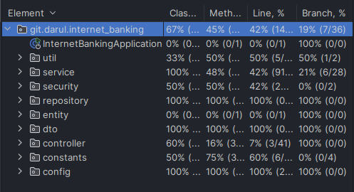

# Internet Banking API

Aplikasi **Internet Banking** berbasis Spring Boot yang menyediakan berbagai fitur seperti:
1. **Pembuatan Akun**: Membuat rekening baru.
2. **Top-Up Balance**: Menambahkan saldo ke rekening.
3. **Login**: Mengakses akun pengguna menggunakan autentikasi JWT.
4. **Transaksi**:
    - **Transaksi Sesama Bank** (Kode Bank: `DARUL`).
    - **Transaksi Bank Luar** dengan kode bank yang dapat diakses melalui endpoint `/api/banks`.
    - **Top-Up e-Wallet** dengan daftar e-Wallet yang dapat diakses melalui endpoint `/api/ewallets`.
5. **Riwayat Transaksi**:
    - Mendapatkan semua transaksi pengguna.
    - Mendapatkan detail transaksi tertentu.

---
## Teknologi yang Digunakan

- **Spring Boot**: Framework utama.
- **Spring Security & JWT**: Untuk autentikasi dan otorisasi.
- **Hibernate (JPA)**: Untuk pengelolaan database.
- **PostgreSQL**: Database yang digunakan.
- **Swagger/OpenAPI**: Untuk dokumentasi API.

---
## Fitur Utama

1. **Pembuatan Akun**
    - Endpoint: `/api/auth/register`
    - Method: `POST`

2. **Login**
    - Endpoint: `/api/auth/login`
    - Method: `POST`
    - Respon: Token JWT untuk akses API yang dilindungi.

3. **Top-Up Balance**
    - Endpoint: `/api/account/topup`
    - Method: `POST`

4. **Transaksi Sesama Bank**
    - Endpoint: `/api/transaction`
    - Method: `POST`

5. **Transaksi Bank Luar**
    - Endpoint: `/api/transactions`
    - Method: `POST`

6. **Top-Up e-Wallet**
    - Endpoint: `/api/transactions`
    - Method: `POST`

7. **Daftar Bank**
    - Endpoint: `/api/banks`
    - Method: `GET`

8. **Daftar e-Wallet**
    - Endpoint: `/api/ewallets`
    - Method: `GET`

9. **Riwayat Transaksi**
    - Endpoint untuk mendapatkan semua transaksi: `/api/transactions/all`
    - Endpoint untuk mendapatkan detail transaksi: `/api/transactions/{id}`

---

## Swagger
Swagger menyediakan dokumentasi lengkap semua endpoint dengan contoh input dan output. Anda juga dapat mencoba API langsung melalui antarmuka Swagger:
- **URL Swagger**:  http://localhost:8080/swagger-ui/index.html.
---

## Testing Result

